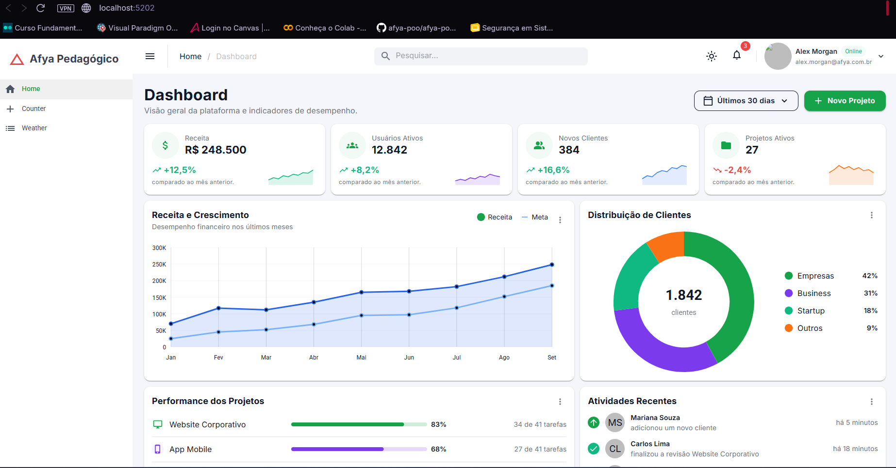
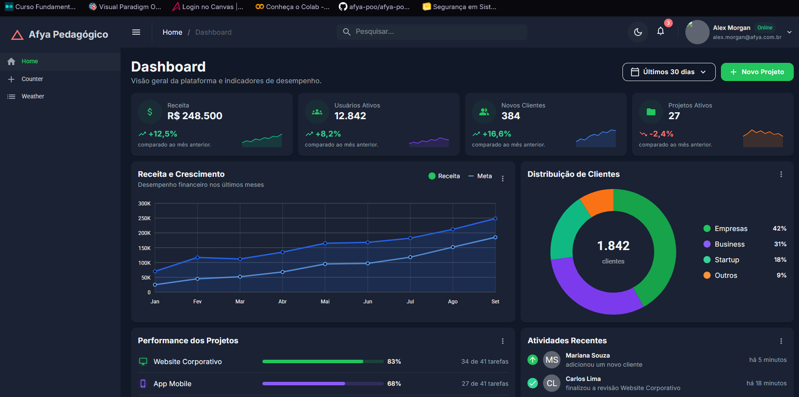
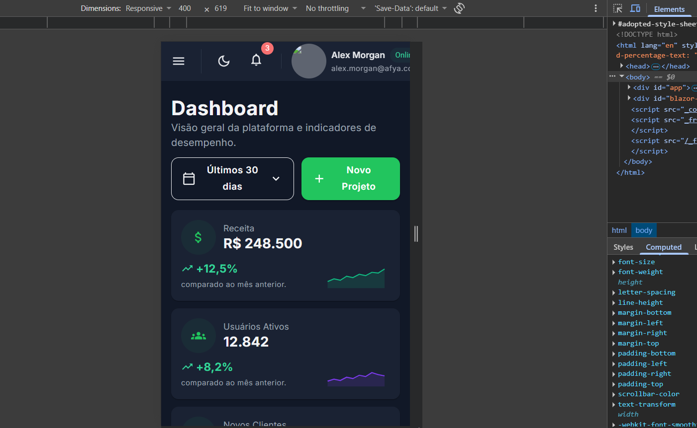
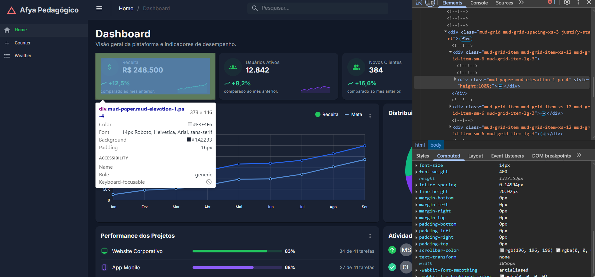

# Afya Admin — Dashboard com Blazor WebAssembly e MudBlazor

## Identificação

| | |
|---|---|
| **Aluno(a)** | Gabrielly Gonçalves Abati |
| **Matrícula** | 2639555 |
| **Faculdade** | São Lucas - Afya |
| **Curso** | Ciência Da Computação|
| **Disciplina** | Programação para sistemas web |
| **Professor(a)** | Liluyoud Cury de Lacerda |
| **Semestre** | 2026.4 |

## Objetivo do projeto

O Afya Admin é um dashboard administrativo desenvolvido para a plataforma fictícia Afya Pedagógico. O objetivo é apresentar, de forma organizada e visual, informações importantes para o acompanhamento da plataforma, como indicadores, receita, clientes, projetos e atividades recentes.

A proposta foi criar uma interface semelhante a um sistema administrativo real, com navegação lateral, barra superior, indicadores de desempenho, gráficos e tabelas. O projeto também busca facilitar a visualização das informações em diferentes tamanhos de tela.

Durante o desenvolvimento, além da estrutura inicial do dashboard, foram implementadas funcionalidades como seleção de período, carregamento de dados por JSON, serviço para acesso aos dados, busca de projetos, navegação entre páginas e persistência da preferência de tema.

## Tecnologias utilizadas

- .NET 10 / Blazor WebAssembly
- MudBlazor 9
- HTML5
- JSON
- JavaScript Interop
- Git
- GitHub

## Como executar

Passo a passo para outra pessoa clonar e rodar o projeto:

Pré-requisitos: É necessário ter o .NET 10 SDK instalado.

```bash
git clone https://github.com/seu-usuario/afya-admin.git
cd afya-admin
dotnet watch
```


## Telas

### Tema claro


### Tema escuro


### Versão mobile


### HTML gerado (DevTools)


O print do DevTools mostra a inspeção do card de **Receita** no Dashboard da aplicação:

* **Componente inspecionado:** O card superior da esquerda, exibindo "Receita - R$ 248.500".
* **HTML gerado:** Uma estrutura `<div>` interna, filha do item de grid `mud-grid-item`, com o estilo em linha `style="height:100%;"`.
* **Classes aplicadas:** `mud-paper`, `mud-elevation-1` e `pa-4`.


## Estrutura do projeto

```text
afya-admin/
│
├── Components/
│   ├── AtividadesRecentes.razor
│   ├── CabecalhoPagina.razor
│   ├── GraficoDistribuicaoClientes.razor
│   ├── GraficoReceita.razor
│   ├── KpiCard.razor
│   ├── PerformanceProjetos.razor
│   ├── ProjetosRecentes.razor
│   └── SeletorPeriodo.razor
│
├── Data/
│   ├── DashboardData.cs
│   ├── DashboardDataModel.cs
│   ├── DashboardService.cs
│   └── IDashboardService.cs
│
├── Layout/
│   └── MainLayout.razor
│
├── Pages/
│   ├── Clientes.razor
│   └── Dashboard.razor
│
├── wwwroot/
│   └── data/
│       └── dashboard.json
│
├── docs/
│   └── prints/
│       ├── tema-claro.png
│       ├── tema-escuro.png
│       ├── mobile.png
│       └
```

Organização das pastas

Components/
Contém os componentes reutilizáveis utilizados para montar o dashboard, como cards, gráficos, tabela de projetos e atividades recentes.

Data/
Contém os modelos de dados, dados utilizados pelo dashboard e o serviço responsável por carregar as informações do arquivo JSON.

Layout/
Contém o layout principal da aplicação, incluindo menu lateral, barra superior, busca, notificações e controle do tema.

Pages/
Contém as páginas da aplicação, incluindo o Dashboard e a página de Clientes.

wwwroot/
Contém arquivos públicos da aplicação, incluindo o arquivo JSON utilizado para os dados do dashboard.

docs/prints/
Contém os registros visuais solicitados para a documentação e entrega do projeto.

## Componentes criados

| Componente                    | Responsabilidade                                        | Parâmetros que recebe             |
| ----------------------------- | ------------------------------------------------------- | --------------------------------- |
| `CabecalhoPagina`             | Exibe o título, subtítulo e ações da página             | `Titulo`, `Subtitulo`, `Acoes`    |
| `KpiCard`                     | Exibe um indicador, sua variação e gráfico de tendência | `Kpi`                             |
| `GraficoReceita`              | Exibe o gráfico de Receita x Meta                       | `Meses`, `Receita`, `Meta`        |
| `GraficoDistribuicaoClientes` | Exibe a distribuição dos clientes por segmento          | `Total`, `Segmentos`              |
| `PerformanceProjetos`         | Exibe o progresso e desempenho dos projetos             | `Projetos`                        |
| `AtividadesRecentes`          | Exibe as atividades realizadas recentemente             | `Atividades`                      |
| `ProjetosRecentes`            | Exibe a tabela de projetos e permite realizar buscas    | `Projetos`, `Busca`               |
| `SeletorPeriodo`              | Permite selecionar o período dos indicadores            | `Opcoes`, `Valor`, `ValorChanged` |

## O que aprendi


1. Como uma aplicação Blazor WebAssembly inicia no navegador? Qual é o papel do `index.html`, da `<div id="app">` e do `Program.cs`?

No meu projeto, o `index.html` é a página inicial carregada pelo navegador e contém a `<div id="app">`, que funciona como o local onde a aplicação Blazor é renderizada. O `Program.cs` é responsável por iniciar a aplicação, configurar os serviços utilizados, adicionar os componentes principais e executar o projeto no navegador.

2. Qual é a diferença entre um **Layout**, uma **Page** e um **Component** neste projeto? Dê um exemplo de cada.

O Layout define a estrutura que será compartilhada pelas páginas, como o menu lateral e a barra superior, sendo o `MainLayout.razor` um exemplo. As Pages representam telas específicas da aplicação, como `Dashboard.razor` e `Clientes.razor`. Já os Components são partes menores e reutilizáveis da interface, como `KpiCard.razor`, que recebe dados e monta um card de indicador.

3. O que é um `RenderFragment` e como o `DashboardCard` usa esse recurso para ser reutilizado por vários cards?

O `RenderFragment` permite passar um conteúdo de interface para dentro de um componente. Assim, um componente pode ter uma estrutura padrão e receber conteúdos diferentes. No meu projeto, esse recurso pode ser usado para criar uma estrutura de card reutilizável, permitindo que diferentes informações sejam colocadas dentro do mesmo modelo de card.

4. Como funciona o `@bind-Valor` no `SeletorPeriodo`? Qual é o papel do `ValorChanged`?

O `@bind-Valor` faz a ligação entre o valor selecionado no componente e uma propriedade do componente pai. Quando o usuário escolhe outro período, o `ValorChanged` é utilizado para avisar o componente pai sobre a alteração. No meu projeto, isso permite que o `Dashboard` saiba qual período foi selecionado no `SeletorPeriodo`.

5. Por que os dados ficam na pasta `Data`, separados dos componentes? Que vantagem isso traz se, no futuro, os dados vierem de uma API?

Os dados ficam separados dos componentes para deixar o projeto mais organizado e evitar que a interface fique responsável também pelo acesso aos dados. No meu projeto, criei modelos e um serviço dentro da pasta `Data` para carregar as informações do JSON. Se futuramente os dados vierem de uma API, seria possível alterar o serviço sem precisar modificar todos os componentes da interface.

6. Como o `MudGrid` com `xs`, `sm` e `lg` faz os cards de KPI se reorganizarem em telas de tamanhos diferentes?

O `MudGrid` permite definir quantas colunas cada elemento deve ocupar de acordo com o tamanho da tela. No meu projeto, os cards utilizam `xs="12"`, `sm="6"` e `lg="3"`. Dessa forma, em telas pequenas um card ocupa toda a largura, em telas médias dois cards podem ficar na mesma linha e em telas grandes quatro cards podem aparecer lado a lado.

7. Como foi possível estilizar a página inteira sem escrever CSS? Explique o papel do tema (`MudTheme`) e das classes utilitárias.

Foi possível utilizar os recursos do próprio MudBlazor, principalmente o `MudTheme`, que permite definir cores, tipografia, fundo, bordas e outras características visuais da aplicação. Também utilizei classes utilitárias do MudBlazor para espaçamento, alinhamento, tamanho e outras configurações, evitando a necessidade de criar um arquivo CSS personalizado.

8. Por que o namespace do projeto é `afya_admin` e não `afya-admin`?

O namespace utiliza `afya_admin` porque o hífen (`-`) não é permitido em identificadores usados pelo C#. Como o nome da pasta e do projeto utiliza `afya-admin`, o .NET utiliza o formato com sublinhado no namespace, ficando `afya_admin`.

## Dificuldades e soluções

**1. Carregamento dos dados através do JSON:**
Uma dificuldade foi organizar os dados do dashboard para que eles não ficassem diretamente nos componentes. Para resolver isso, criei os modelos `DashboardDataModel`, `KpiData`, a interface `IDashboardService` e o `DashboardService`, que é responsável por carregar os dados do arquivo `dashboard.json`.

**2. Ícones dos indicadores não apareciam após carregar os dados do JSON:**
Depois de passar os dados dos KPIs para o JSON, alguns ícones deixaram de aparecer porque o arquivo armazenava apenas o nome do ícone, enquanto o componente precisava do valor correspondente do MudBlazor. Resolvi criando um método de conversão no `Dashboard.razor`, que transforma nomes como `AttachMoney`, `Groups` e `PeopleAlt` nos respectivos ícones do MudBlazor.

**3. Implementação da busca de projetos:**
Outra dificuldade foi fazer a busca da barra superior funcionar na tabela de projetos. Resolvi utilizando `CascadingValue` no `MainLayout` para compartilhar o texto pesquisado e `CascadingParameter` no componente `ProjetosRecentes`, que utiliza esse valor para filtrar projetos pelo nome, cliente ou responsável.

## Melhorias futuras

Como melhorias futuras, eu implementaria a integração com uma API e um banco de dados real, permitindo que os clientes e projetos fossem cadastrados e atualizados de forma dinâmica. Também poderia adicionar autenticação, permissões de usuários, notificações funcionais e filtros mais avançados.

Durante o desenvolvimento, também implementei alguns desafios propostos no tutorial, como o **seletor de período funcional**, o **carregamento dos dados através de JSON**, a **criação de um serviço de dados**, a **busca de projetos**, a **persistência da preferência do tema claro/escuro**, além dos ajustes de **responsividade e acessibilidade**.
